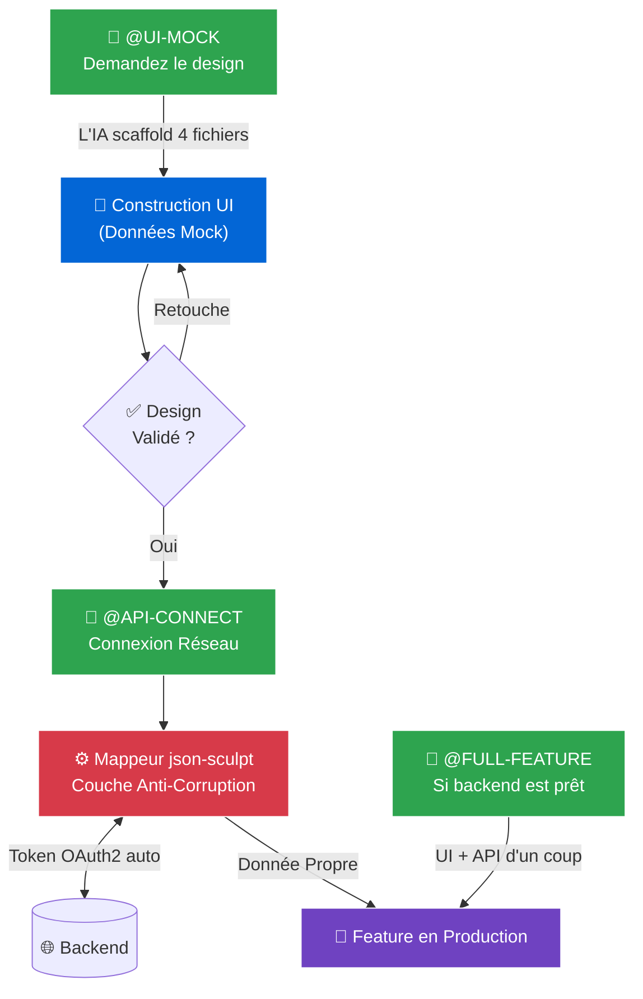
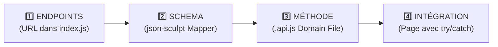

<div align="center">
  
  
  
  

  <h1>🚀 SKILLS WECHAT PMT</h1>
  <p><strong>L'Architecture Frontend Ultime · Pilotable par IA · Zéro Conflit Git</strong></p>
</div>

<br/>

> **Ce kit n'est pas un template.** C'est un **cerveau architectural** qui force les développeurs (et les IA) à coder avec la rigueur d'un Tech Lead Senior sur WeChat Mini Program. Il encapsule des années de bonnes pratiques en quelques fichiers.

---

## 📋 Table des Matières

1. [Le Problème qu'on résout](#-le-problème-quon-résout)
2. [Le Workflow Mock-First](#-le-workflow-mock-first-comment-on-code-ici)
3. [Les Mots-Clés Magiques (IA)](#-les-mots-clés-magiques-pour-piloter-lia)
4. [Les Bonnes Pratiques UI (Rien de Caché)](#-les-bonnes-pratiques-ui-rien-de-caché)
5. [Les Bonnes Pratiques API](#-les-bonnes-pratiques-api)
6. [Les Pièges Classiques à Éviter](#-les-pièges-classiques-à-éviter)
7. [Contenu du Kit](#-contenu-du-kit)
8. [Installation en 2 Minutes](#-installation-en-2-minutes)

---

## 🎯 Le Problème qu'on résout

Sans standard, un projet WeChat Mini Program avec 3 développeurs devient incontrôlable :

| Problème Classique | Notre Solution |
| :--- | :--- |
| L'IA génère du `wx.request` direct dans les pages | `.cursorrules` impose le `HttpClient` sécurisé |
| Conflits Git sur les fichiers d'API partagés | 1 domaine = 1 fichier `.api.js` isolé |
| Le backend change et l'UI toute entière casse | `json-sculpt` (couche anti-corruption) |
| Le dev frontend bloqué par un backend non prêt | Workflow `@UI-MOCK` avec fausses données |
| Des animations qui "choppent" sur mobile | WXS obligatoire pour tous les formatages de vue |
| Texte en dur = app non-traduisible | `i18n` forcé par le `.cursorrules` |

---

## 🌊 Le Workflow Mock-First (Comment on code ici)



---

## 🔑 Les Mots-Clés Magiques (Pour Piloter l'IA)

Glissez le fichier **`.cursorrules`** à la racine de votre projet. L'IA le lira automatiquement. Ensuite, utilisez ces 3 mots dans vos prompts :

| Commande | Quand l'utiliser | Ce que l'IA va faire |
| :---: | :--- | :--- |
| <kbd>@UI-MOCK</kbd> | Backend non prêt / Phase de design | Crée le `.wxml`, `.wxss`, `.js`, `.json` avec des données fausses mais réalistes. WXS imposé, `i18n` imposé, `lifetimes` WeChat respectés. |
| <kbd>@API-CONNECT</kbd> | Design validé, backend prêt | Crée le mappeur `json-sculpt`, la méthode dans la classe `.api.js`, gère le token OAuth2 et branche le tout sur la page existante. |
| <kbd>@FULL-FEATURE</kbd> | Quand le backend et la maquette sont tous les deux prêts | Saute l'étape Mock. Construit l'UI ET le réseau en une seule passe. |

### Exemples de Prompts

```
"Crée-moi la page de profil utilisateur @UI-MOCK"
→ L'IA construit un design complet avec des données fausses. Zéro réseau.

"Intègre l'endpoint GET /api/v1/profile sur la page profil @API-CONNECT"
→ L'IA crée le schéma, la méthode API et branche le tout proprement.

"Construis le module Panier complet @FULL-FEATURE"
→ L'IA fait tout en une fois (Vue + Réseau).
```

---

## 🎨 Les Bonnes Pratiques UI (Rien de Caché)

### Règle 1 : La "State Machine" (Anti-Stress Total)

Pour toute page avec plusieurs états (Chargement → Contenu → Erreur → Succès), utilisez **une seule variable `uiState`**. Changez-la pour visualiser n'importe quel état instantanément sans cliquer dans l'application.

```javascript
Page({
  data: {
    // 💡 Changez cette valeur pour tester n'importe quel état en 1 seconde
    // Options : 'loading' | 'content' | 'empty' | 'error' | 'success'
    uiState: 'content',
    mockData: { title: "Résultat", price: 1500 }
  }
});
```

```xml
<view wx:if="{{uiState === 'loading'}}" class="skeleton animate-pulse" />
<view wx:elif="{{uiState === 'content'}}" class="content animate-fade-in">
  <text>{{mockData.title}}</text>
</view>
<view wx:elif="{{uiState === 'empty'}}"><text>Aucun résultat</text></view>
<view wx:elif="{{uiState === 'error'}}"><text>Erreur réseau</text></view>
```

### Règle 2 : Page vs Composant (Ne JAMAIS confondre)

```
📄 Page (pages/)              🧩 Composant (components/)
─────────────────────         ───────────────────────────
✅ onLoad()                   ✅ lifetimes: { attached() {} }
✅ onShow()                   ✅ properties: { monProp: {} }
✅ onUnload()                 ✅ this.triggerEvent('action', data)
❌ lifetimes                  ❌ onLoad()
```

### Règle 3 : WXS Obligatoire pour le Formatage (Performance)

WeChat exécute JS et WXML sur deux threads séparés. Formatter dans le JS et envoyer via `setData()` est lent. Utilisez le WXS dans la vue :

```xml
<wxs src="../../utils/wxs/filters.wxs" module="f" />

<!-- ❌ NE JAMAIS FAIRE ça en JS : this.setData({ priceFormatted: "1 500 FCFA" }) -->
<!-- ✅ Faites ça directement dans la vue : -->
<text>{{ f.formatPrice(mockData.price) }}</text>
<text>{{ f.formatDate(mockData.date) }}</text>
```

> ⚠️ **Rappel Critique** : Le WXS s'écrit en **ES5 uniquement** (pas de `const`, pas de `=>`, pas de déstructuration).

### Règle 4 : Animations CSS Natives (Fluidité Garantie)

```css
/* ✅ Ces classes s'activent automatiquement quand wx:if affiche l'élément */

.animate-fade-in { animation: fadeIn 0.3s ease-out forwards; }
@keyframes fadeIn { from { opacity: 0; } to { opacity: 1; } }

/* Style "Apple" (Courbe Spring) */
.animate-slide-up {
  animation: slideUp 0.4s cubic-bezier(0.16, 1, 0.3, 1) forwards;
}
@keyframes slideUp {
  from { transform: translateY(100%); opacity: 0; }
  to { transform: translateY(0); opacity: 1; }
}

/* ✅ Protection Encoche iPhone (TOUJOURS sur les barres fixes) */
.fixed-bottom-bar { padding-bottom: env(safe-area-inset-bottom); }
```

### Règle 5 : Communication entre Composants

```
🧩 Composant Enfant               📄 Page Parent
──────────────────                ────────────────
this.triggerEvent('select', data) ↔ bind:select="onItemSelected"

🌍 Donnée Globale (plusieurs pages)
──────────────────────────────────
Bus.setState('user.profile', data) ↔ Bus.onState('user.profile', cb)
```

---

## ⚙️ Les Bonnes Pratiques API

### Le Flux Obligatoire par Endpoint (4 Étapes)



### Exemple Complet (Copier-Coller Ready)

```javascript
// ─── 1. URL ──────────────────────────────────────────────────
// utils/apis/user.api.js
const ENDPOINTS = { GET_PROFILE: '/api/v1/users/me' };

// ─── 2. SCHEMA (Filtre anti-corruption) ──────────────────────
// utils/mappers/user.js
export const UserSchema = {
  id: "@link.user_id",
  name: (d) => `${d.first_name} ${d.last_name}`,
  isPremium: "@link.subscription.active::boolean"
};

// ─── 3. MÉTHODE ──────────────────────────────────────────────
async getProfile() {
  await authenticate();
  const res = await httpClient.get(ENDPOINTS.GET_PROFILE);
  if (!res.success) throw new Error(res.error?.message);
  return sculpt.data({ data: res.data, to: UserSchema });
}

// ─── 4. INTÉGRATION DANS LA PAGE ─────────────────────────────
async loadProfile() {
  this.setData({ uiState: 'loading' });
  try {
    const profile = await userAPI.getProfile();
    this.setData({ profile, uiState: 'content' });
  } catch (e) {
    this.setData({ uiState: 'error' });
    wx.showToast({ title: e.message, icon: 'none' });
  }
}
```

---

## ⚠️ Les Pièges Classiques à Éviter

| ❌ À Ne JAMAIS Faire | ✅ La Bonne Pratique |
| :--- | :--- |
| `wx.request({ url: '...' })` dans une page | Toujours utiliser `httpClient` ou `userAPI.getProfile()` |
| `onLoad()` dans un `Component` | Utiliser `lifetimes: { attached() {} }` |
| `const` ou `=>` dans un fichier `.wxs` | Écrire en ES5 : `var` et `function()` |
| `Bus.emit('click', data)` entre composants | Utiliser `this.triggerEvent('click', data)` |
| `this.setData({ formattedDate: '...' })` | Utiliser les filtres `WXS` dans la vue |
| Texte en dur : `<text>Bienvenue</text>` | Utiliser l'i18n : `{{ t('accueil.titre') }}` |
| `this.setData({ timer: setInterval(...) })` | `this.timer = setInterval(...)` (pas dans data) |

---

## 📦 Contenu du Kit

```text
📦 skills_wechat_pmt/
 ┣ 🤖 .cursorrules                     → Le cerveau IA (API + UI fusionnés)
 ┣ 📖 DOC_API_POUR_DEVELOPPEURS.md     → Cheat Sheet : Intégration API A→Z
 ┣ 🎨 DOC_UI_POUR_DEVELOPPEURS.md      → Cheat Sheet : Pages & Composants
 ┣ 🎬 DOC_FLUX_COMPLEXES_ANIMATIONS.md → Modèles : Wizards, Bottom Sheets, Skeletons
 ┣ 🧠 SKILL.md                         → Règles IA (API uniquement, pour Gemini)
 ┣ 🎨 SKILL_UI.md                      → Règles IA (UI uniquement, pour Gemini)
 ┗ 📋 README.md
```

---

## 🛠️ Installation en 2 Minutes

```bash
# 1. Cloner ce kit
git clone https://github.com/MalickDevWeb/skills_wechat_pmt.git

# 2. Copier le fichier IA à la racine de VOTRE projet
cp skills_wechat_pmt/.cursorrules ./votre-projet-wechat/

# 3. Copier les guides humains dans le dossier docs
cp skills_wechat_pmt/DOC_*.md ./votre-projet-wechat/docs/
```

**Cursor / Copilot / Windsurf :** Le `.cursorrules` est lu automatiquement. Aucune configuration supplémentaire.

**Gemini / Antigravity :** Copiez `SKILL.md` et `SKILL_UI.md` dans `~/.gemini/config/skills/`.

---

<div align="center">
  <strong>Propulsé par des standards d'ingénierie modernes · Conçu pour scaler · Écrit pour durer</strong>
</div>
