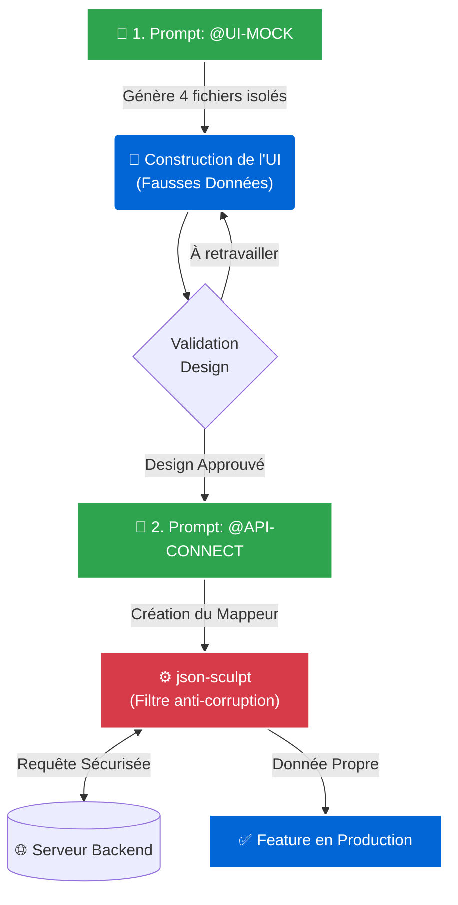
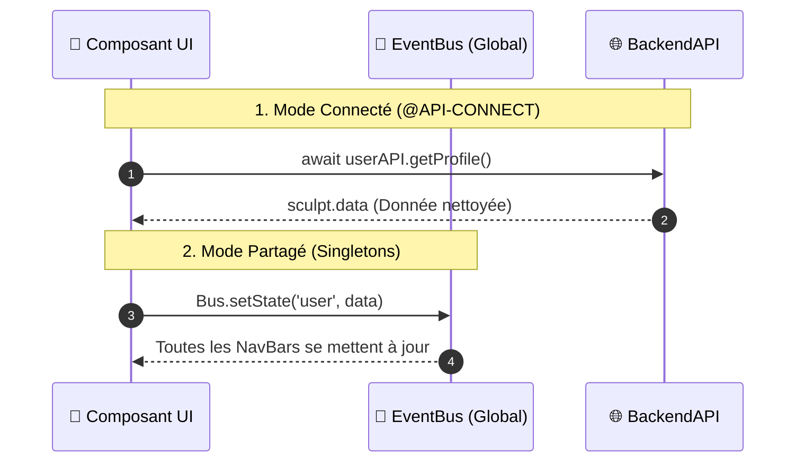

  
  
  
  
  <h1>🚀 SKILLS WECHAT PMT</h1>
  
<strong>L'Architecture Frontend Ultime : Pilotable par IA & Zéro Conflit</strong>

 

> **Ce kit n'est pas un simple template.** C'est un **cerveau architectural** conçu pour les équipes ambitieuses. Il combine une isolation stricte des API, des modèles UI haute-performance, et un fichier magique (`.cursorrules`) qui force les Intelligences Artificielles (Copilot, Cursor) à coder avec la rigueur d'un Tech Lead Senior.

---

## 🌊 Le Workflow "Mock-First" (Comment on code ici)

Voici le flux de travail visuel imposé par cette architecture. On ne connecte jamais l'API avant d'avoir validé le design.

---

## 🏛️ L'Architecture Globale (Data Flow)

Comment les données circulent-elles sans créer de "Code Spaghetti" ?

---

## 🔑 Piloter l'IA (Les Mots de Pouvoir)

Glissez le fichier `.cursorrules` à la racine de votre projet. Ensuite, utilisez ces commandes dans votre chat IA :

| Commande Magique | Action de l'Intelligence Artificielle | Résultat |
| :--- | :--- | :--- |
| <kbd>@UI-MOCK</kbd> | Ignore le réseau. Construit une interface pixel-perfect avec WXS et des fausses données. | 🎨 Prototype visuel immédiat |
| <kbd>@API-CONNECT</kbd> | Se connecte au Backend. Construit le Mappeur `json-sculpt` et gère le Token OAuth2. | 🔌 Intégration Robuste |
| <kbd>@FULL-FEATURE</kbd> | Saute l'étape Mock. Construit la vue ET le réseau en simultané. | 🚀 Déploiement Rapide |

---

## 📦 Bibliothèque Humaine (Guides de Survie)

L'IA a son `.cursorrules`, mais vos développeurs humains ont aussi leurs guides :

- 📖 **`DOC_API_POUR_DEVELOPPEURS.md`** : L'antisèche ultime pour intégrer n'importe quel endpoint (GET, POST, PUT) les yeux fermés.
- 🎨 **`DOC_UI_POUR_DEVELOPPEURS.md`** : Comment créer des composants isolés, gérer les `lifetimes` WeChat, et formater via WXS.
- 🎬 **`DOC_FLUX_COMPLEXES_ANIMATIONS.md`** : Code copiable pour des parcours stressants (Wizards, Skeletons, Bottom Sheets).

---

  <i>Propulsé par des standards d'ingénierie modernes. Écrit pour scale.</i>

