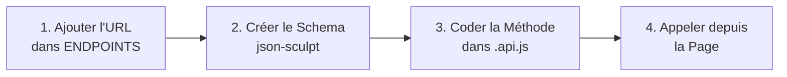

<div align="center">
  
  
  

  <h1>⚡ Skills WeChat PMT</h1>
  <p>Le Standard de Code pour WeChat Mini Program.<br/>Copie. Adapte. Livre.</p>
</div>

---

## En 1 Phrase

Ce kit te donne **le seul workflow à connaître** pour coder une interface WeChat et consommer une API de manière professionnelle, sans jamais créer de conflits Git avec ton équipe.

---

## 🚀 Démarrage Rapide

```bash
# Copie le cerveau IA dans ton projet
cp .cursorrules ./ton-projet/

# Copie les guides dans ton dossier docs
cp DOC_*.md ./ton-projet/docs/
```

---

## 📐 Partie 1 — Créer une Interface UI

### La Règle des 4 Fichiers

Chaque page ou composant = 4 fichiers dans son propre dossier. **On ne touche jamais les fichiers des autres.**

```
pages/ma-page/
  ├── index.js      ← La logique
  ├── index.wxml    ← Le visuel (HTML)
  ├── index.wxss    ← Le style (CSS)
  └── index.json    ← La config
```

---

### La Règle des États (State Machine)

Au lieu de coder dans le vide, tu définis **tous tes écrans** dans une seule variable `uiState`. Tu peux tester n'importe quel écran en changeant juste un mot.

**`index.js`**
```javascript
Page({
  data: {
    // Changer cette valeur pour voir n'importe quel écran instantanément
    // Valeurs : 'loading' | 'content' | 'empty' | 'error'
    uiState: 'content',

    // Tes fausses données (mock). Copie la forme exacte du JSON du backend.
    user: {
      name: "Malick Dev",
      balance: 25000,
      isPremium: true
    }
  }
});
```

**`index.wxml`**
```xml
<!-- Import du formateur de données (OBLIGATOIRE) -->
<wxs src="../../utils/wxs/filters.wxs" module="f" />

<!-- État : Chargement -->
<view wx:if="{{uiState === 'loading'}}" class="skeleton" />

<!-- État : Contenu -->
<view wx:elif="{{uiState === 'content'}}" class="container animate-fade-in">
  <text class="name">{{ user.name }}</text>

  <!-- On formate TOUJOURS avec WXS, jamais dans le JS -->
  <text class="balance">{{ f.formatPrice(user.balance) }}</text>
</view>

<!-- État : Vide -->
<view wx:elif="{{uiState === 'empty'}}">
  <text>Aucune donnée disponible</text>
</view>

<!-- État : Erreur -->
<view wx:elif="{{uiState === 'error'}}">
  <text>Une erreur est survenue. Réessaie.</text>
</view>
```

---

### Les Animations (Copier-Coller dans `app.wxss`)

```css
/* Fondu — Pour les pages et listes */
.animate-fade-in { animation: fadeIn 0.3s ease-out forwards; }
@keyframes fadeIn { from { opacity: 0; } to { opacity: 1; } }

/* Glissement depuis le bas — Pour les pop-ups et tiroirs */
.animate-slide-up { animation: slideUp 0.4s cubic-bezier(0.16, 1, 0.3, 1) forwards; }
@keyframes slideUp {
  from { transform: translateY(100%); opacity: 0; }
  to { transform: translateY(0); opacity: 1; }
}

/* Protection iPhone — Sur TOUTES les barres fixes en bas */
.safe-bottom { padding-bottom: env(safe-area-inset-bottom); }
```

---

### Page vs Composant — Ne jamais confondre

| | Page `pages/` | Composant `components/` |
|---|---|---|
| Cycle de vie | `onLoad()` `onShow()` | `lifetimes: { attached() {} }` |
| Parler au parent | _(c'est la racine)_ | `this.triggerEvent('action', data)` |
| Données globales | `Bus.setState('cle', data)` | `Bus.onState('cle', callback)` |

---

## 🔌 Partie 2 — Consommer une API

### Le Flux en 4 Étapes (Toujours dans cet ordre)



---

### Étape 1 — L'URL (`utils/apis/index.js`)
```javascript
const ENDPOINTS = {
  GET_USER: '/api/v1/users/me',       // ← Ajoute ton URL ici
  CREATE_ORDER: '/api/v1/orders'
};
```

---

### Étape 2 — Le Schema Mappeur (`utils/mappers/user.js`)

Le schema protège ton UI des changements du backend. Si le backend renomme un champ, tu changes juste ici.

```javascript
export const UserSchema = {
  id:        "@link.user_id",                          // Valeur simple
  fullName:  (d) => `${d.first_name} ${d.last_name}`, // Calcul personnalisé
  balance:   "@link.wallet.amount::number",            // Forçage de type
  isPremium: "@link.subscription.active::boolean"      // Vrai/Faux
};
```

---

### Étape 3 — La Méthode (`utils/apis/user.api.js`)

```javascript
import { httpClient } from './http.js';
import { authenticate } from './auth.js';
import { sculpt } from '../json-sculpt/sculpt.js';
import { UserSchema } from '../mappers/user.js';

class UserAPI {

  // GET — Récupérer une donnée
  async getProfile() {
    await authenticate();                                    // Gère le token auto
    const res = await httpClient.get(ENDPOINTS.GET_USER);

    if (!res.success) throw new Error(res.error?.message);  // Gestion d'erreur

    return sculpt.data({ data: res.data, to: UserSchema }); // Données propres
  }

  // POST — Envoyer une donnée
  async createOrder(payload) {
    await authenticate();
    const res = await httpClient.post(ENDPOINTS.CREATE_ORDER, payload);

    if (!res.success) throw new Error(res.error?.message);
    return res.data;
  }
}

export const userAPI = new UserAPI();
```

Puis déclare-le dans le hub (`utils/apis/index.js`) :
```javascript
export { userAPI } from './user.api.js';
```

---

### Étape 4 — L'Appel dans la Page

```javascript
import { userAPI } from '../../utils/apis/index.js';

Page({
  data: { uiState: 'loading', user: null },

  async onLoad() {
    try {
      const user = await userAPI.getProfile();
      this.setData({ user, uiState: 'content' });
    } catch (error) {
      this.setData({ uiState: 'error' });
      wx.showToast({ title: error.message, icon: 'none' });
    }
  }
});
```

---

## 🤖 Pilote l'IA avec ces 3 Mots

Si tu utilises Cursor, Copilot ou Gemini avec le fichier `.cursorrules` :

| Tape dans ton prompt | L'IA fait quoi |
|---|---|
| `@UI-MOCK` | Construit le design complet avec de fausses données. Pas de réseau. |
| `@API-CONNECT` | Connecte une page existante à son endpoint API. |
| `@FULL-FEATURE` | Fait le design ET l'API en une seule fois. |

---

## ❌ Les Erreurs Interdites

| Interdit | Pourquoi | Bonne pratique |
|---|---|---|
| `wx.request()` direct | Contourne la sécurité | Utiliser `httpClient` |
| `onLoad()` dans un Component | Crash silencieux | `lifetimes: { attached() {} }` |
| `const` dans un `.wxs` | Erreur de syntaxe WeChat | Utiliser `var` (ES5 seulement) |
| Texte en dur dans le WXML | App non-traduisible | Utiliser les clés `i18n` |
| `Bus.emit()` entre composants proches | Couplage invisible | `this.triggerEvent()` |

---

<div align="center">
  <i>Lisez une fois. Appliquez toujours.</i>
</div>
